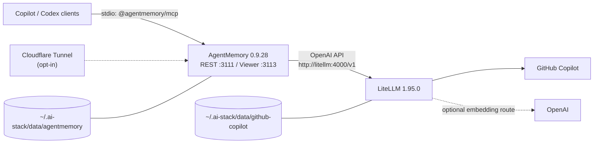

# ai-stack

Local, Docker-managed AI infrastructure for Windows 11: GitHub Copilot
subscription models through LiteLLM, persistent AgentMemory, and shared memory
tools for GitHub Copilot and Codex clients.

This MVP is deliberately local-first. It does **not** implement a remote
ChatGPT MCP endpoint. ChatGPT remote MCP requires Streamable HTTP transport and
OAuth 2.1 authorization, which are deferred to a future security-focused
release.

## Quick start

Prerequisites:

- Windows 11 with Docker Desktop using WSL2 and mirrored networking
- Windows PowerShell 5.1 or newer
- A GitHub account with Copilot model access
- Node.js 20 or newer for the AgentMemory MCP shim
- GitHub Copilot CLI and/or Codex CLI when installing client plugins

```powershell
git clone https://github.com/tldrr/ai-stack.git
cd ai-stack
.\ai-stack.ps1 setup
.\ai-stack.ps1 start
.\ai-stack.ps1 logs -Service litellm
```

The first Copilot model request starts GitHub's device flow. Follow the
verification URL and code in the LiteLLM logs. The OAuth credential persists
under `%USERPROFILE%\.ai-stack\data\github-copilot`.

Install memory integration after the stack is healthy:

```powershell
.\ai-stack.ps1 doctor
.\ai-stack.ps1 install-clients
```

Restart Copilot CLI, the GitHub Copilot app, Codex CLI, and ChatGPT/Codex
desktop after installation. Desktop apps may require an explicit plugin trust
or enable action in their UI. Copilot app shares CLI-configured MCP servers and
skills; Codex/ChatGPT desktop plugin enablement remains environment-specific.

## Architecture



All containers share the project-only `ai-stack` bridge network. Container DNS
uses `litellm`; host clients use `localhost`. Docker needs outbound Internet
access for GitHub, optional OpenAI embeddings, package installation during the
AgentMemory image build, and an enabled tunnel.

| Surface | Host binding | Container | Purpose |
| --- | --- | --- | --- |
| LiteLLM | `127.0.0.1:4000` | `litellm:4000` | OpenAI-compatible Copilot proxy |
| AgentMemory REST | `127.0.0.1:3111` | `agentmemory:3111` | Bearer-authenticated memory API |
| AgentMemory viewer | `127.0.0.1:3113` | `agentmemory:3113` | Local memory viewer |
| iii stream | none | `agentmemory:3112` | Internal AgentMemory worker transport |

Host ports are configurable in `~\.ai-stack\.env`; every published port remains
bound to `127.0.0.1`. LiteLLM is never part of the tunnel profile. All generated
configuration, credentials, and container data are consolidated under the
ACL-restricted `%USERPROFILE%\.ai-stack` directory, independent of the clone.

## Management commands

| Command | Behavior |
| --- | --- |
| `setup` | Creates `~\.ai-stack`, generates local secrets, and writes the MCP launcher |
| `configure` | Runs setup and opens `~\.ai-stack\.env` in Notepad |
| `configure-tunnel` | Creates a locally managed tunnel, DNS routes, credentials, and config file |
| `start [-Tunnel]` | Builds and starts the stack, optionally including Cloudflare |
| `stop` | Stops containers without deleting credentials or memories |
| `restart` | Restarts running services |
| `status` | Shows Compose service state |
| `doctor` | Checks Docker, local config, Node, and health endpoints |
| `logs [-Service ...]` | Follows redacted-by-design service logs |
| `install-clients` | Merges MCP config and installs official upstream plugins |
| `uninstall` | Removes containers/network but preserves `~\.ai-stack` |
| `uninstall -DeleteData` | Deletes AgentMemory and Copilot data after typing `DELETE` |

`-Force` allows non-interactive data deletion and should be used only in
automation that intentionally discards all memories and Copilot login state.

Upgrades from older ai-stack releases are automatic. Stop the old stack, then
run `setup`; the command moves root `.env`/`.state` files and copies the two
legacy Docker volumes into the home directory before removing those migrated
volumes. Repository-local `.ai-stack` state from preview versions is also moved.
Setup refuses to overwrite conflicting data.

## Models and embeddings

`config/litellm.yaml` exposes a curated set of enabled Copilot aliases.
Responses-only models have `model_info.mode: responses`, allowing LiteLLM to
bridge OpenAI Chat Completions callers correctly.

AgentMemory calls LiteLLM at the internal URL `http://litellm:4000/v1`.
Its default chat model is `gpt-5.6-sol`. Change
`AGENTMEMORY_LLM_MODEL` in `~\.ai-stack\.env` to another listed alias.

Embeddings default to AgentMemory's bundled local provider, so semantic search
works without an external key. To use OpenAI
`text-embedding-3-small`, set both values:

```dotenv
OPENAI_API_KEY=your-local-secret
AGENTMEMORY_EMBEDDING_PROVIDER=openai
```

The external OpenAI key is supplied only to LiteLLM. AgentMemory reaches the
embedding alias through LiteLLM using the local proxy key. A Copilot
subscription does not include OpenAI embeddings.

## Client integration

The generated MCP launcher uses the official, version-pinned shim:

```powershell
npx -y @agentmemory/mcp@0.9.28
```

It sets `AGENTMEMORY_URL=http://localhost:3111`,
`AGENTMEMORY_TOOLS=all`, and loads the bearer secret from
`~\.ai-stack\agentmemory-secret`. No bearer value is written to a client config.
To copy the bearer without displaying it, run this from any directory:

```powershell
(Get-Content (Join-Path $HOME '.ai-stack\agentmemory-secret') -Raw).Trim() | Set-Clipboard
```

The installer creates timestamped backups before changing an existing file and
preserves all unrelated entries:

- Copilot: merges `agentmemory` into
  `%USERPROFILE%\.copilot\mcp-config.json` (or `$COPILOT_HOME`) and runs
  `copilot plugin install rohitg00/agentmemory:plugin`.
- Codex: merges `agentmemory` into `%USERPROFILE%\.codex\config.toml` (or
  `$CODEX_HOME`), then runs
  `codex plugin marketplace add rohitg00/agentmemory` and
  `codex plugin add agentmemory@agentmemory`.

Copilot CLI reloads MCP configuration on its next launch or `/mcp`. The
Copilot app normally shares the CLI MCP/skills configuration but may prompt for
plugin trust. Codex Desktop currently exposes MCP tools, while upstream
plugin-local lifecycle hooks may require `agentmemory connect codex
--with-hooks` until desktop hook dispatch support lands. That optional upstream
workaround modifies global hooks and is not run automatically by ai-stack.

This is a **local MCP** design: the desktop/CLI launches a stdio process, and
that process calls AgentMemory REST on localhost. It is not a public,
Streamable HTTP MCP server.

## Optional Cloudflare Tunnel

This stack uses a **locally managed** named tunnel. The route definition is a
generated config file, not dashboard state:

| `~\.ai-stack\.env` hostname | Config-file service |
| --- | --- |
| `CLOUDFLARE_REST_HOSTNAME` | `http://agentmemory:3111` |
| `CLOUDFLARE_VIEWER_HOSTNAME` | `http://agentmemory:3113` |

Install `cloudflared`, set `CLOUDFLARE_TUNNEL_NAME` and both hostnames in
`~\.ai-stack\.env`, then run:

```powershell
.\ai-stack.ps1 configure-tunnel
.\ai-stack.ps1 start -Tunnel
```

On the first run, `cloudflared` opens one browser authorization. It uses that
login to create the named tunnel, generate tunnel-specific credentials, and
create both DNS records; there is no API-token creation or secret copy/paste.
Later runs reuse the local authorization and tunnel credentials. The command
writes
`~\.ai-stack\cloudflared\config.yml`, validates its ingress rules, and idempotently
creates both DNS routes. Tunnel credentials remain in the git-ignored
`~\.ai-stack\cloudflared\credentials.json`. Docker mounts this directory
read-only, and `restart: unless-stopped` provides autostart with Docker Desktop.

The profile is opt-in and does not publish LiteLLM. Apply Cloudflare Access to
the viewer hostname so the HTML surface is identity-gated. Access policies are
Cloudflare account control-plane resources and are not part of the
`cloudflared` ingress file; manage them separately with Cloudflare Access or
Terraform. AgentMemory also requires its bearer secret for viewer API calls.
Keep AgentMemory bearer authentication on the REST hostname; if Cloudflare
Access is added there, non-browser clients also need an Access service token.

No extra MCP or streaming route is required. The official MCP shim is a local
stdio process that calls the exposed AgentMemory REST API. Port `3112` is iii's
internal worker stream and must remain unexposed. A future remote ChatGPT MCP
would need a separate Streamable HTTP endpoint plus OAuth 2.1; this tunnel does
not provide either.

Do not also run a token-installed Windows `Cloudflared` service for this stack.
After the Docker-managed connector is healthy, remove the old service from an
elevated terminal with `cloudflared service uninstall`.

The tunnel only exposes AgentMemory REST and its viewer. It does not make
AgentMemory compatible with ChatGPT remote MCP and must not be configured as a
ChatGPT connector.

## Security boundaries

- Repository `.ai-stack/`, legacy `.env`/`.state/`, and backups are git-ignored.
  Home state is outside the repository and protected separately.
- On Windows, setup removes inherited ACLs from `~\.ai-stack` and grants access
  only to the current user, SYSTEM, and local Administrators.
- The AgentMemory bearer is mounted as a Docker secret and copied to
  `/data/.hmac`; it is not present in Compose environment metadata or logs.
- Container shutdown forwards termination to AgentMemory and its detached iii
  engine, with a 30-second grace period for buffered state to reach `/data`.
- Copilot OAuth state lives in `~\.ai-stack\data\github-copilot`.
- AgentMemory memories and indexes live in `~\.ai-stack\data\agentmemory`.
- All host ports use explicit loopback bindings.
- The viewer rejects unexpected Host headers and requires bearer auth for API
  calls because it binds to the private container network for tunnel support.
- Anyone with local filesystem or Docker daemon access can read secrets and memory
  data. This stack does not defend against a compromised local administrator.

Secrets and memories are not application-encrypted at rest. Use BitLocker on
the home-directory drive. Gitignore and ACLs reduce accidental disclosure but are
not substitutes for full-disk encryption. The viewer HTML is publicly reachable
when the tunnel is enabled; API data still requires the AgentMemory bearer.
Put Cloudflare Access in front of the viewer hostname before treating it as a
private deployment.

`~\.ai-stack\agentmemory-secret` is required state, not a disposable cache. The
container refuses to start if it does not match the persisted `/data/.hmac`,
preventing accidental credential rotation against existing memory data.

Do not paste `~\.ai-stack\.env`, `~\.ai-stack\agentmemory-secret`, data-directory
contents, or unredacted authentication logs into issues.

## Backup and restore

Stop writes before taking a consistent backup:

```powershell
.\ai-stack.ps1 stop
.\ai-stack.ps1 setup
New-Item -ItemType Directory -Force backups | Out-Null
Compress-Archive -Path (Join-Path $HOME '.ai-stack') -DestinationPath backups\ai-stack.zip -Force
```

Restore while the stack is stopped:

```powershell
.\ai-stack.ps1 stop
$stackHome = Join-Path $HOME '.ai-stack'
$saved = Join-Path $HOME ".ai-stack.before-restore-$(Get-Date -Format yyyyMMdd-HHmmss)"
Move-Item $stackHome $saved
Expand-Archive backups\ai-stack.zip -DestinationPath $HOME
.\ai-stack.ps1 start
```

Keep `$saved` until the restored stack passes `doctor`; it is the rollback copy.
`Compress-Archive` does not encrypt the ZIP. Backups contain credentials and
private memories, so encrypt the archive before copying it outside this machine.
Tunnel credentials cannot be downloaded again; restoring their directory is
required to reconnect the same locally managed tunnel.

Do not put the live `~\.ai-stack` directory in OneDrive. AgentMemory
uses SQLite and file-backed streams; concurrent sync can cause lock conflicts or
corruption. A stopped, encrypted backup archive is appropriate for OneDrive.

## Updates

Versions are pinned in `.env.example`, `compose.yaml`, and the AgentMemory
Dockerfile. Update one component at a time:

1. Read upstream release notes, especially LiteLLM Copilot provider changes and
   AgentMemory/iii compatibility.
2. Change the exact version. Keep AgentMemory and `@agentmemory/mcp` aligned.
3. Run `.\tests\Run-Tests.ps1` and render Compose.
4. Back up `~\.ai-stack`, rebuild with `start`, then run `doctor`.

AgentMemory 0.9.28 requires iii 0.11.2; do not independently bump iii.

## Troubleshooting

**LiteLLM stays unauthenticated:** follow `logs -Service litellm`, make one
model request, and complete GitHub's device flow. Deleting the Copilot token
directory under `~\.ai-stack\data` forces a new login.

**AgentMemory is unhealthy:** check `logs -Service agentmemory`, then confirm
`~\.ai-stack\agentmemory-secret` exists without printing it. AgentMemory starts
independently while LiteLLM waits for first-time Copilot device authorization.

**MCP silently exposes only a few tools:** the official shim falls back to a
small local mode if `http://localhost:3111/agentmemory/livez` is unreachable.
Run `doctor`; with the stack reachable, `AGENTMEMORY_TOOLS=all` exposes the full
REST-backed tool set.

**Custom ports do not work:** rerun `setup` after editing `~\.ai-stack\.env` so the local
MCP launcher remains present, restart the stack, then restart clients.

**Viewer returns a host or auth error:** ensure the local/public hostname
matches `~\.ai-stack\.env`, restart AgentMemory, and enter the bearer from the
local `~\.ai-stack\agentmemory-secret` only in the trusted viewer prompt.

**Tunnel profile reports a missing config:** run `configure-tunnel`. If the
named tunnel already exists but `~\.ai-stack\cloudflared\credentials.json` is
missing, restore that credential from backup or choose a new tunnel name;
Cloudflare does not allow downloading a locally managed tunnel secret again.

**Docker Desktop cannot reach the Internet:** verify WSL2 mirrored networking,
VPN/proxy settings, and Docker Desktop DNS. Service-to-service traffic should
still use Docker names such as `litellm`, never host `localhost`.

## Development

Run the dependency-free PowerShell test suite:

```powershell
powershell.exe -NoProfile -ExecutionPolicy Bypass -File .\tests\Run-Tests.ps1
.\ai-stack.ps1 setup
docker compose --env-file "$HOME/.ai-stack/.env" -f compose.yaml config --quiet
```

The AgentMemory image follows the upstream Coolify all-in-one pattern from
commit `d60652a7058773fa9428fa720eda38942f12f014`, with a local Docker-secret
adaptation so clients and the container share one non-logged credential.
