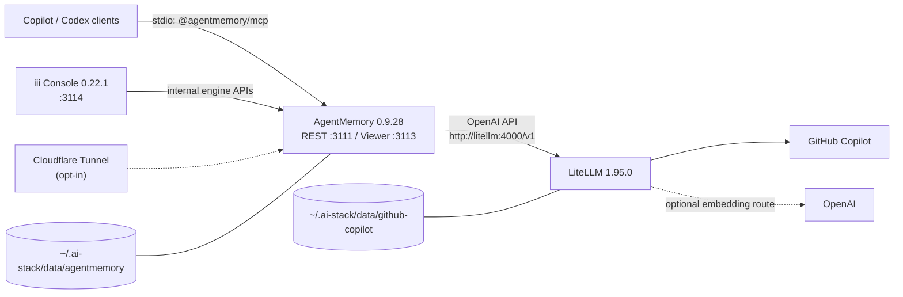

# ai-stack

Local, Docker-managed AI infrastructure for Windows 11: GitHub Copilot
subscription models through LiteLLM, persistent AgentMemory, and shared memory
tools for GitHub Copilot and Codex clients.

This MVP is deliberately local-first. It does **not** implement a remote
ChatGPT MCP endpoint. ChatGPT remote MCP requires Streamable HTTP transport and
OAuth 2.1 authorization, which are deferred to a future security-focused
release.

## Quick start

Prerequisites:

- Windows 11 with Docker Desktop using WSL2 and mirrored networking
- Windows PowerShell 5.1 or newer
- A GitHub account with Copilot model access
- Git and Node.js 22 or newer

Install the client CLIs you use, clone the repository, and allow scripts for
the current PowerShell process:

```powershell
winget install --id GitHub.Copilot --exact
winget install --id OpenAI.Codex --exact

git clone https://github.com/tldrr/ai-stack.git
cd ai-stack
Set-ExecutionPolicy -Scope Process Bypass -Force

.\ai-stack.ps1 setup
.\ai-stack.ps1 start
.\ai-stack.ps1 doctor
.\ai-stack.ps1 install-clients
```

The client CLI commands are optional when that client is not used. Setup stores
all generated state in `%USERPROFILE%\.ai-stack`. The first Copilot model
request starts GitHub's device flow; watch the logs and follow the displayed
verification URL and code:

```powershell
.\ai-stack.ps1 logs -Service litellm
```

The OAuth credential persists under
`%USERPROFILE%\.ai-stack\data\github-copilot`.

Restart Copilot CLI, the GitHub Copilot app, Codex CLI, and ChatGPT/Codex
desktop after installation. Desktop apps may require an explicit plugin trust
or enable action in their UI. Copilot app shares CLI-configured MCP servers and
skills; Codex/ChatGPT desktop plugin enablement remains environment-specific.

## Architecture



All containers share the project-only `ai-stack` bridge network. Container DNS
uses `litellm`; host clients use `localhost`. Docker needs outbound Internet
access for GitHub, optional OpenAI embeddings, package installation during the
AgentMemory image build, and an enabled tunnel.

| Surface | Host binding | Container | Purpose |
| --- | --- | --- | --- |
| LiteLLM | `127.0.0.1:4000` | `litellm:4000` | OpenAI-compatible Copilot proxy |
| AgentMemory REST | `127.0.0.1:3111` | `agentmemory:3111` | Bearer-authenticated memory API |
| AgentMemory viewer | `127.0.0.1:3113` | `agentmemory:3113` | Local memory viewer |
| iii Console | `127.0.0.1:3114` | `iii-console:3114` | Functions, workers, State, and Traces |
| iii stream | none | `agentmemory:3112` | Internal AgentMemory worker transport |

Host ports are configurable in `~\.ai-stack\.env`; every published port remains
bound to `127.0.0.1`. LiteLLM is never part of the tunnel profile. All generated
configuration, credentials, and container data are consolidated under the
ACL-restricted `%USERPROFILE%\.ai-stack` directory, independent of the clone.

Open the local interfaces at:

- Viewer: `http://localhost:3113`
- iii Console: `http://localhost:3114`
- State: `http://localhost:3114/states`
- Traces: `http://localhost:3114/traces`

## Management commands

| Command | Behavior |
| --- | --- |
| `setup` | Creates `~\.ai-stack`, generates local secrets, and writes the MCP launcher |
| `configure` | Runs setup and opens `~\.ai-stack\.env` in Notepad |
| `configure-tunnel` | Creates a locally managed tunnel, DNS routes, credentials, and config file |
| `start [-Tunnel]` | Builds and starts the stack, optionally including Cloudflare |
| `stop` | Stops containers without deleting credentials or memories |
| `restart` | Reconciles Compose configuration and recreates changed services |
| `status` | Shows Compose service state |
| `doctor` | Checks Docker, local config, Node, health endpoints, and capture integrations |
| `logs [-Service ...]` | Follows redacted-by-design service logs |
| `install-clients` | Interactively selects local or remote AgentMemory, merges MCP config, and installs official upstream plugins |
| `install-capture [-Agent ...]` | Installs official live-capture integrations for Copilot, pi, and Hermes |
| `import-sessions [-Source ...] [-DryRun]` | Backfills supported local conversation histories into AgentMemory |
| `enrich-sessions [-Source ...] [-DryRun]` | Resumably summarizes imports, builds graph batches, consolidates memory, and infers project scope |
| `uninstall` | Removes containers/network but preserves `~\.ai-stack` |
| `uninstall -DeleteData` | Deletes AgentMemory and Copilot data after typing `DELETE` |

For `uninstall`, `-Force` allows non-interactive data deletion and should be
used only in automation that intentionally discards all memories and Copilot
login state. For `import-sessions`, it reprocesses unchanged sessions without
creating duplicate observation IDs. For `enrich-sessions`, it regenerates
summaries and reruns consolidation; completed graph batches remain checkpointed.
Every non-dry enrichment run also applies AgentMemory's project-scope migration
to newly consolidated durable memories and reports any ambiguous records.

Upgrades from older ai-stack releases are automatic. Stop the old stack, then
run `setup`; the command moves root `.env`/`.state` files and copies the two
legacy Docker volumes into the home directory before removing those migrated
volumes. Repository-local `.ai-stack` state from preview versions is also moved.
Setup refuses to overwrite conflicting data.

## Models and embeddings

`config/litellm.yaml` exposes a curated set of enabled Copilot aliases.
Responses-only models have `model_info.mode: responses`, allowing LiteLLM to
bridge OpenAI Chat Completions callers correctly.

AgentMemory calls LiteLLM at the internal URL `http://litellm:4000/v1`.
Its default chat model is `gpt-5.6-sol`. Change
`AGENTMEMORY_LLM_MODEL` in `~\.ai-stack\.env` to another listed alias.
Knowledge-graph extraction and memory consolidation are enabled by default.
Historical imports retain every source observation first; summaries, durable
memories, and graph nodes are derived in a separate enrichment pass.

Embeddings default to AgentMemory's bundled local provider, so semantic search
works without an external key. To use OpenAI
`text-embedding-3-small`, set both values:

```dotenv
OPENAI_API_KEY=your-local-secret
AGENTMEMORY_EMBEDDING_PROVIDER=openai
```

The external OpenAI key is supplied only to LiteLLM. AgentMemory reaches the
embedding alias through LiteLLM using the local proxy key. A Copilot
subscription does not include OpenAI embeddings.

## Client integration

The generated MCP launcher uses the official, version-pinned shim:

```powershell
npx -y @agentmemory/mcp@0.9.28
```

It sets `AGENTMEMORY_URL=http://localhost:3111`,
`AGENTMEMORY_TOOLS=all`, and loads the bearer secret from
`~\.ai-stack\agentmemory-secret`. No bearer value is written to a client config.
To copy the bearer without displaying it, run this from any directory:

```powershell
(Get-Content (Join-Path $HOME '.ai-stack\agentmemory-secret') -Raw).Trim() | Set-Clipboard
```

The installer creates timestamped backups before changing an existing file and
preserves all unrelated entries:

- Copilot: merges `agentmemory` into
  `%USERPROFILE%\.copilot\mcp-config.json` (or `$COPILOT_HOME`) and runs
  `copilot plugin install rohitg00/agentmemory:plugin`.
- Codex: merges `agentmemory` into `%USERPROFILE%\.codex\config.toml` (or
  `$CODEX_HOME`), then runs
  `codex plugin marketplace add rohitg00/agentmemory` and
  `codex plugin add agentmemory@agentmemory`.

Copilot CLI reloads MCP configuration on its next launch or `/mcp`. The
Copilot app normally shares the CLI MCP/skills configuration but may prompt for
plugin trust. Codex Desktop currently exposes MCP tools, while upstream
plugin-local lifecycle hooks may require `agentmemory connect codex
--with-hooks` until desktop hook dispatch support lands. That optional upstream
workaround modifies global hooks and is not run automatically by ai-stack.

This is a **stdio MCP** design: the desktop/CLI launches a local process, and
that process calls either local or explicitly configured remote AgentMemory
REST. It is not a public Streamable HTTP MCP server.

To connect clients on another machine to an HTTPS AgentMemory REST endpoint,
securely transfer the server's `~\.ai-stack\agentmemory-secret` as a file, then
run:

```powershell
.\ai-stack.ps1 install-clients `
  -ServerUrl https://memory-api.example.com `
  -SecretFile C:\secure\agentmemory-secret
```

When those parameters are omitted, `install-clients` asks whether to use the
local stack or a remote URL and prompts for the secret-file path only when
needed. The remote bearer is copied into ACL-restricted
`~\.ai-stack\remote-client`; Copilot and Codex configs contain only the launcher
path. Remote launchers force REST proxy mode so an unavailable server cannot
silently fall back to process-local memory.

## Continuous capture

Install automatic capture after the stack is running:

```powershell
.\ai-stack.ps1 install-capture
# Or select one integration:
.\ai-stack.ps1 install-capture -Agent Pi
```

The installer downloads the official AgentMemory integrations from pinned
upstream commit `d60652a7058773fa9428fa720eda38942f12f014`, verifies downloaded
files against pinned SHA-256 or Git blob manifests, and creates timestamped
backups before changing existing files.

| Agent | Integration | Installed behavior |
| --- | --- | --- |
| Copilot CLI/app | Official AgentMemory plugin plus local MCP shim | Hooks capture new conversations; MCP exposes recall and memory tools |
| pi | Official native TypeScript extension in each detected Windows/WSL pi profile | Recalls context before a turn and captures the completed conversation |
| Hermes | Official native memory provider under `$HERMES_HOME\plugins\agentmemory` (or `%LOCALAPPDATA%\hermes` by default) | Prefetches relevant memory and syncs turns/session completion |

Copilot, Hermes, and pi read the local URL and bearer from
`%USERPROFILE%\.agentmemory\.env`; WSL pi receives the equivalent file beneath
its Linux home with mode `0600`. The installer generates these local,
gitignored files from `~\.ai-stack\agentmemory-secret`; it never writes the
bearer into a plugin source file or agent configuration. Copilot's official
plugin MCP descriptors are both routed through the authenticated, pinned local
launcher because Copilot versions may resolve either descriptor. Its hooks are
routed through a generated dotenv runner because hook subprocesses do not
inherit the MCP launcher's environment. Hermes'
`memory.provider` key is merged without replacing unrelated YAML. pi relies on
its normal `~/.pi/agent/extensions` auto-discovery, so existing settings are not
rewritten. The pinned Hermes provider receives a one-line Windows compatibility
adaptation so its upstream dotenv loader uses Python's resolved home when
`$HOME` is unset.

`AGENTMEMORY_INJECT_CONTEXT=true` is applied to both the Docker worker and the
protected native hook environment. Hooks can therefore retrieve relevant prior
context before a new turn. Rerun `install-capture` after changing this setting.
`AGENTMEMORY_AUTO_COMPRESS=false` remains explicit: upstream issue
[#138](https://github.com/rohitg00/agentmemory/issues/138) documents excessive
LLM usage from per-observation compression. Summarization, consolidation, and
knowledge-graph extraction remain enabled without that costly feature.
`AGENTMEMORY_SLOTS=true` enables pinned, size-limited structured context such as
an interview story bank or career profile without enabling per-observation LLM
work.

Restart each installed agent after installation. Copilot app can require a
one-time plugin trust action in its UI. Capture stores source observations
immediately; AgentMemory's enabled consolidation and graph workflows process
them according to the upstream lifecycle. Historical import remains available
for clients without hooks and for reconciling older sessions.

## Historical session import

Preview every supported local store before importing:

```powershell
.\ai-stack.ps1 import-sessions -Source All -DryRun
.\ai-stack.ps1 import-sessions -Source All
.\ai-stack.ps1 enrich-sessions -Source All -DryRun
.\ai-stack.ps1 enrich-sessions -Source All
```

Use `-Source Hermes`, `Pi`, `Copilot`, or `VSCode` to process one source. The
VS Code adapter discovers every Stable/Insiders profile, folder workspace, and
empty-window chat store automatically, so no workspace list is required.
The pi adapter also discovers every non-Docker WSL distribution and recursively
scans the default user's `~/.pi/agent/sessions` tree.

| Source | Local history used |
| --- | --- |
| Hermes | `%LOCALAPPDATA%\hermes\sessions\*.json` |
| pi | Windows and non-Docker WSL `~/.pi/agent/sessions/**/*.jsonl` |
| Copilot CLI/app | `%USERPROFILE%\.copilot\session-store.db` |
| VS Code Copilot Chat | `%APPDATA%\Code*\User\...\chatSessions\*.jsonl` |

The import is resumable and idempotent. Stable IDs are derived from the native
source/session IDs, a manifest containing hashes and observation IDs is kept
at `~\.ai-stack\imports\manifest.json`, and changed sessions remove superseded
observations. Summary checkpoints also include the source content hash; edited
transcripts are resummarized, their affected derived memories are removed, and
the graph is rebuilt from checkpointed batches. Metadata-only or empty sessions
are skipped. Node.js 22 or newer is required only for reading Copilot's SQLite
session store. VS Code append-only mutation logs are replayed to reconstruct the
latest complete chat state.

Only user and assistant text is imported. The adapters exclude request
headers, cookies, hidden system/developer prompts, VS Code thinking blocks,
tool inputs/results, error payloads, and attachments. Common token, key,
password, JWT, and private-key patterns are redacted as a defense in depth;
this is not a guarantee that arbitrary secrets embedded in prose will be
detected.

With the default local embedding provider, conversion and indexing do not send
transcripts to an external LLM. If
`AGENTMEMORY_EMBEDDING_PROVIDER=openai` is configured, imported text is sent
through the configured OpenAI embedding route. Imported work history becomes
available to every client sharing this AgentMemory instance, so apply the same
company data-handling rules to `~\.ai-stack` and its backups. Re-run the import
command to capture new VS Code history; Copilot CLI/app sessions created after
plugin installation are also captured live by the official AgentMemory hooks.

Bulk import intentionally stores and indexes observations without impersonating
a live session-stop event. Run `enrich-sessions` afterward to summarize each
session from its observation text, extract AgentMemory graph nodes and edges in
checkpointed adaptive batches of up to 20 source-grounded session summaries,
and run durable-memory consolidation. The summaries make the graph less noisy;
all original observations remain independently searchable and retrievable.
Because AgentMemory's graph reset is global, a rebuild includes every available
summarized session—including live sessions—rather than discarding unrelated
knowledge when one historical source changes.
Rerunning the command skips existing summaries and graph batches. Graph
checkpoints contain hashes and IDs—not transcript text—and persist with the
AgentMemory data directory.

## Optional Cloudflare Tunnel

This stack uses a **locally managed** named tunnel for stable first-level
origins and an optional Cloudflare Worker for nested public aliases:

| `~\.ai-stack\.env` hostname | Config-file service |
| --- | --- |
| `CLOUDFLARE_REST_HOSTNAME` | `http://agentmemory:3111` |
| `CLOUDFLARE_VIEWER_HOSTNAME` | `http://agentmemory:3113` |
| `CLOUDFLARE_CONSOLE_HOSTNAME` | `http://iii-console-auth:3115` |

The Console origin is never routed directly to iii Console. A Caddy sidecar
requires a generated `X-Ai-Stack-Origin` secret before proxying WebSocket or HTTP
traffic. The edge Worker holds that secret, while Cloudflare Access authenticates
users before requests reach the Worker. The generated origin value lives in
ACL-restricted `~\.ai-stack`, not Compose metadata or checked-in configuration.

```powershell
winget install --id Cloudflare.cloudflared --exact
.\ai-stack.ps1 configure
.\ai-stack.ps1 configure-tunnel `
  -RestHostname memory-api.example.com `
  -ViewerHostname memory.example.com
.\ai-stack.ps1 start -Tunnel
.\ai-stack.ps1 configure-edge `
  -RestHostname api.mem.example.com `
  -ViewerHostname mem.example.com `
  -ConsoleHostname iii.mem.example.com `
  -ConsoleOriginHostname iii-origin.example.com
```

On the first run, `cloudflared` opens one browser authorization. It uses that
login to create the named tunnel, generate tunnel-specific credentials, and
create the DNS records; there is no API-token creation or secret copy/paste.
Later runs reuse the local authorization and tunnel credentials. The command
writes
`~\.ai-stack\cloudflared\config.yml`, validates its ingress rules, and idempotently
creates the DNS routes. Tunnel credentials remain in the git-ignored
`~\.ai-stack\cloudflared\credentials.json`. Docker mounts this directory
read-only, and `restart: unless-stopped` provides autostart with Docker Desktop.

`configure-edge` pins Wrangler 4.120.0 and creates Worker Custom Domains, which
issue certificates for nested names such as `iii.mem.example.com` without Total
TLS. Console proxying is fail-closed during deployment. On its first run, the
command leaves the Console route disabled and asks for a self-hosted Cloudflare
Access application when one is not already present:

1. In Cloudflare Zero Trust, create a self-hosted application for
   `iii.mem.example.com`.
2. Add a restrictive `Allow` policy for the intended email address or identity
   group. Cloudflare One-time PIN is sufficient for a single-user deployment.
3. Rerun `configure-edge`. It verifies the Cloudflare Access redirect before
   enabling Console proxying.

Access application creation is the one manual Cloudflare step because Wrangler
OAuth does not include Access application write permission. All Tunnel, DNS,
Worker, custom-domain, and Worker-secret operations use the CLI. The tunnel
profile remains opt-in and never publishes LiteLLM. AgentMemory bearer
authentication still protects REST and viewer API calls.

No extra MCP or streaming route is required. The official MCP shim is a local
stdio process that calls the exposed AgentMemory REST API. Port `3112` is iii's
internal worker stream and must remain unexposed. A future remote ChatGPT MCP
would need a separate Streamable HTTP endpoint plus OAuth 2.1; this tunnel does
not provide either.

Do not also run a token-installed Windows `Cloudflared` service for this stack.
After the Docker-managed connector is healthy, remove the old service from an
elevated terminal with `cloudflared service uninstall`.

The tunnel and edge Worker can expose AgentMemory REST, viewer, and the
Access-authenticated iii Console. Access protects the SPA, same-origin
`/api/engine/*` requests, and WebSocket connection; the independent origin secret
prevents bypassing it through the tunnel hostname. This does not make AgentMemory
compatible with ChatGPT remote MCP and must not be configured as a ChatGPT
connector.

## Security boundaries

- Repository `.ai-stack/`, legacy `.env`/`.state/`, and backups are git-ignored.
  Home state is outside the repository and protected separately.
- On Windows, setup removes inherited ACLs from `~\.ai-stack` and grants access
  only to the current user, SYSTEM, and local Administrators.
- The AgentMemory bearer is mounted as a Docker secret and copied to
  `/data/.hmac`; it is not present in Compose environment metadata or logs.
- Container shutdown forwards termination to AgentMemory and its detached iii
  engine, with a 30-second grace period for buffered state to reach `/data`.
- Copilot OAuth state lives in `~\.ai-stack\data\github-copilot`.
- AgentMemory memories and indexes live in `~\.ai-stack\data\agentmemory`.
- Historical import hashes live in `~\.ai-stack\imports`; transcript text is
  written only to AgentMemory's data directory, not the manifest.
- All host ports use explicit loopback bindings.
- iii Console remains loopback-only at `http://localhost:3114`; State is
  `http://localhost:3114/states` and Traces is
  `http://localhost:3114/traces`. Remote access is allowed only through the
  Cloudflare Access application, edge Worker, and secret-authenticated origin
  proxy.
- The viewer rejects unexpected Host headers and requires bearer auth for API
  calls because it binds to the private container network for tunnel support.
- Anyone with local filesystem or Docker daemon access can read secrets and memory
  data. This stack does not defend against a compromised local administrator.

Secrets and memories are not application-encrypted at rest. Use BitLocker on
the home-directory drive. Gitignore and ACLs reduce accidental disclosure but are
not substitutes for full-disk encryption. The viewer HTML is publicly reachable
when the tunnel is enabled; API data still requires the AgentMemory bearer.
Put Cloudflare Access in front of the viewer hostname before treating it as a
private deployment.

`~\.ai-stack\agentmemory-secret` is required state, not a disposable cache. The
container refuses to start if it does not match the persisted `/data/.hmac`,
preventing accidental credential rotation against existing memory data.

Do not paste `~\.ai-stack\.env`, `~\.ai-stack\agentmemory-secret`, data-directory
contents, or unredacted authentication logs into issues.

## Backup and restore

Stop writes before taking a consistent backup:

```powershell
.\ai-stack.ps1 stop
.\ai-stack.ps1 setup
New-Item -ItemType Directory -Force backups | Out-Null
Compress-Archive -Path (Join-Path $HOME '.ai-stack') -DestinationPath backups\ai-stack.zip -Force
```

Restore while the stack is stopped:

```powershell
.\ai-stack.ps1 stop
$stackHome = Join-Path $HOME '.ai-stack'
$saved = Join-Path $HOME ".ai-stack.before-restore-$(Get-Date -Format yyyyMMdd-HHmmss)"
Move-Item $stackHome $saved
Expand-Archive backups\ai-stack.zip -DestinationPath $HOME
.\ai-stack.ps1 start
```

Keep `$saved` until the restored stack passes `doctor`; it is the rollback copy.
`Compress-Archive` does not encrypt the ZIP. Backups contain credentials and
private memories, so encrypt the archive before copying it outside this machine.
Tunnel credentials cannot be downloaded again; restoring their directory is
required to reconnect the same locally managed tunnel.

Do not put the live `~\.ai-stack` directory in OneDrive. AgentMemory
uses SQLite and file-backed streams; concurrent sync can cause lock conflicts or
corruption. A stopped, encrypted backup archive is appropriate for OneDrive.

## Updates

Versions are pinned in `.env.example`, `compose.yaml`, and the AgentMemory
Dockerfile. Update one component at a time:

1. Read upstream release notes, especially LiteLLM Copilot provider changes and
   AgentMemory/iii compatibility.
2. Change the exact version. Keep AgentMemory and `@agentmemory/mcp` aligned.
3. Run `.\tests\Run-Tests.ps1` and render Compose.
4. Back up `~\.ai-stack`, rebuild with `start`, then run `doctor`.

AgentMemory 0.9.28 requires iii 0.11.2; do not independently bump iii.

## Troubleshooting

**LiteLLM stays unauthenticated:** follow `logs -Service litellm`, make one
model request, and complete GitHub's device flow. Deleting the Copilot token
directory under `~\.ai-stack\data` forces a new login.

**AgentMemory is unhealthy:** check `logs -Service agentmemory`, then confirm
`~\.ai-stack\agentmemory-secret` exists without printing it. AgentMemory starts
independently while LiteLLM waits for first-time Copilot device authorization.

**Imported sessions are missing:** run `import-sessions -DryRun` first. Empty
session metadata is intentionally ignored. Copilot history also requires
Node.js 22+, and VS Code must have persisted the chat under its user profile.
Use `import-sessions -Force` to reconcile a repaired or restored AgentMemory
data directory.

**Imported sessions have no summaries or graph:** feature flags enable live
session-stop enrichment but do not retroactively process bulk imports. Run
`enrich-sessions -DryRun`, followed by `enrich-sessions`. If a model or circuit
breaker temporarily fails, rerun the command; completed summaries and graph
batches are skipped.

**MCP silently exposes only a few tools:** the official shim falls back to a
small local mode if `http://localhost:3111/agentmemory/livez` is unreachable.
Run `doctor`; with the stack reachable, `AGENTMEMORY_TOOLS=all` exposes the full
REST-backed tool set.

**MCP tools return empty results while the viewer contains memories:** rerun
`install-capture -Agent Copilot`, fully restart Copilot, and run `doctor`. This
repairs both plugin MCP descriptors so the shim receives the local bearer
through the generated launcher.

**New conversations are not captured:** rerun `install-capture -Agent <name>`
after an agent update, then fully restart that agent. For pi, confirm its active
profile is under Windows or a running non-Docker WSL distribution. For Hermes,
confirm `memory.provider: agentmemory` remains selected in its config. Do not
paste the bearer into plugin files; rerunning the installer safely recreates the
protected local environment file.

**Custom ports do not work:** rerun `setup` after editing `~\.ai-stack\.env` so the local
MCP launcher remains present, restart the stack, then restart clients.

**Viewer returns a host or auth error:** ensure the local/public hostname
matches `~\.ai-stack\.env`, restart AgentMemory, and enter the bearer from the
local `~\.ai-stack\agentmemory-secret` only in the trusted viewer prompt.

**Tunnel profile reports a missing config:** run `configure-tunnel`. If the
named tunnel already exists but `~\.ai-stack\cloudflared\credentials.json` is
missing, restore that credential from backup or choose a new tunnel name;
Cloudflare does not allow downloading a locally managed tunnel secret again.

**Docker Desktop cannot reach the Internet:** verify WSL2 mirrored networking,
VPN/proxy settings, and Docker Desktop DNS. Service-to-service traffic should
still use Docker names such as `litellm`, never host `localhost`.

## Development

Run the dependency-free PowerShell test suite:

```powershell
powershell.exe -NoProfile -ExecutionPolicy Bypass -File .\tests\Run-Tests.ps1
node --check .\scripts\read-copilot-sessions.mjs
node --check .\docker\agentmemory\patch-import-index.mjs
.\ai-stack.ps1 setup
docker compose --env-file "$HOME/.ai-stack/.env" -f compose.yaml config --quiet
```

The AgentMemory image follows the upstream Coolify all-in-one pattern from
commit `d60652a7058773fa9428fa720eda38942f12f014`, with a local Docker-secret
adaptation so clients and the container share one non-logged credential. The
image also applies a build-time-verified compatibility patch to the published
0.9.28 bundle so JSON imports receive the BM25/vector indexing behavior present
in the pinned upstream source revision.
