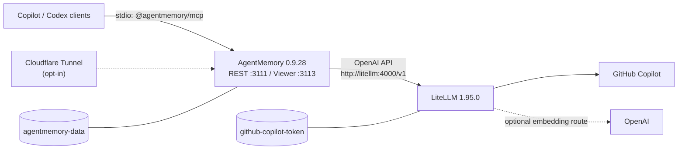

# ai-stack

Local, Docker-managed AI infrastructure for Windows 11: GitHub Copilot
subscription models through LiteLLM, persistent AgentMemory, and shared memory
tools for GitHub Copilot and Codex clients.

This MVP is deliberately local-first. It does **not** implement a remote
ChatGPT MCP endpoint. ChatGPT remote MCP requires Streamable HTTP transport and
OAuth 2.1 authorization, which are deferred to a future security-focused
release.

## Quick start

Prerequisites:

- Windows 11 with Docker Desktop using WSL2 and mirrored networking
- Windows PowerShell 5.1 or newer
- A GitHub account with Copilot model access
- Node.js 20 or newer for the AgentMemory MCP shim
- GitHub Copilot CLI and/or Codex CLI when installing client plugins

```powershell
git clone https://github.com/tldrr/ai-stack.git
cd ai-stack
.\ai-stack.ps1 setup
.\ai-stack.ps1 start
.\ai-stack.ps1 logs -Service litellm
```

The first Copilot model request starts GitHub's device flow. Follow the
verification URL and code in the LiteLLM logs. The OAuth credential persists
in a named Docker volume.

Install memory integration after the stack is healthy:

```powershell
.\ai-stack.ps1 doctor
.\ai-stack.ps1 install-clients
```

Restart Copilot CLI, the GitHub Copilot app, Codex CLI, and ChatGPT/Codex
desktop after installation. Desktop apps may require an explicit plugin trust
or enable action in their UI. Copilot app shares CLI-configured MCP servers and
skills; Codex/ChatGPT desktop plugin enablement remains environment-specific.

## Architecture



All containers share the project-only `ai-stack` bridge network. Container DNS
uses `litellm`; host clients use `localhost`. Docker needs outbound Internet
access for GitHub, optional OpenAI embeddings, package installation during the
AgentMemory image build, and an enabled tunnel.

| Surface | Host binding | Container | Purpose |
| --- | --- | --- | --- |
| LiteLLM | `127.0.0.1:4000` | `litellm:4000` | OpenAI-compatible Copilot proxy |
| AgentMemory REST | `127.0.0.1:3111` | `agentmemory:3111` | Bearer-authenticated memory API |
| AgentMemory viewer | `127.0.0.1:3113` | `agentmemory:3113` | Local memory viewer |
| iii stream | none | `agentmemory:3112` | Internal AgentMemory worker transport |

Host ports are configurable in `.env`; every published port remains bound to
`127.0.0.1`. LiteLLM is never part of the tunnel profile.

## Management commands

| Command | Behavior |
| --- | --- |
| `setup` | Creates `.env`, generates local secrets, and writes the MCP launcher |
| `configure` | Runs setup and opens the git-ignored `.env` in Notepad |
| `start [-Tunnel]` | Builds and starts the stack, optionally including Cloudflare |
| `stop` | Stops containers without deleting credentials or memories |
| `restart` | Restarts running services |
| `status` | Shows Compose service state |
| `doctor` | Checks Docker, local config, Node, and health endpoints |
| `logs [-Service ...]` | Follows redacted-by-design service logs |
| `install-clients` | Merges MCP config and installs official upstream plugins |
| `uninstall` | Removes containers/network but preserves config and volumes |
| `uninstall -DeleteData` | Deletes both named volumes after typing `DELETE` |

`-Force` allows non-interactive volume deletion and should be used only in
automation that intentionally discards all memories and Copilot login state.

## Models and embeddings

`config/litellm.yaml` exposes a curated set of enabled Copilot aliases.
Responses-only models have `model_info.mode: responses`, allowing LiteLLM to
bridge OpenAI Chat Completions callers correctly.

AgentMemory calls LiteLLM at the internal URL `http://litellm:4000/v1`.
Its default chat model is `gpt-5.6-sol`. Change
`AGENTMEMORY_LLM_MODEL` in `.env` to another listed alias.

Embeddings default to AgentMemory's bundled local provider, so semantic search
works without an external key. To use OpenAI
`text-embedding-3-small`, set both values:

```dotenv
OPENAI_API_KEY=your-local-secret
AGENTMEMORY_EMBEDDING_PROVIDER=openai
```

The external OpenAI key is supplied only to LiteLLM. AgentMemory reaches the
embedding alias through LiteLLM using the local proxy key. A Copilot
subscription does not include OpenAI embeddings.

## Client integration

The generated MCP launcher uses the official, version-pinned shim:

```powershell
npx -y @agentmemory/mcp@0.9.28
```

It sets `AGENTMEMORY_URL=http://localhost:3111`,
`AGENTMEMORY_TOOLS=all`, and loads the bearer secret from
`.state/agentmemory-secret`. No bearer value is written to a client config.

The installer creates timestamped backups before changing an existing file and
preserves all unrelated entries:

- Copilot: merges `agentmemory` into
  `%USERPROFILE%\.copilot\mcp-config.json` (or `$COPILOT_HOME`) and runs
  `copilot plugin install rohitg00/agentmemory:plugin`.
- Codex: merges `agentmemory` into `%USERPROFILE%\.codex\config.toml` (or
  `$CODEX_HOME`), then runs
  `codex plugin marketplace add rohitg00/agentmemory` and
  `codex plugin add agentmemory@agentmemory`.

Copilot CLI reloads MCP configuration on its next launch or `/mcp`. The
Copilot app normally shares the CLI MCP/skills configuration but may prompt for
plugin trust. Codex Desktop currently exposes MCP tools, while upstream
plugin-local lifecycle hooks may require `agentmemory connect codex
--with-hooks` until desktop hook dispatch support lands. That optional upstream
workaround modifies global hooks and is not run automatically by ai-stack.

This is a **local MCP** design: the desktop/CLI launches a stdio process, and
that process calls AgentMemory REST on localhost. It is not a public,
Streamable HTTP MCP server.

## Optional Cloudflare Tunnel

Create a remotely managed Cloudflare Tunnel, then configure two public
hostnames in the Cloudflare dashboard:

| Public hostname | Tunnel service |
| --- | --- |
| `CLOUDFLARE_REST_HOSTNAME` | `http://agentmemory:3111` |
| `CLOUDFLARE_VIEWER_HOSTNAME` | `http://agentmemory:3113` |

Put the tunnel token and the two matching hostnames in `.env`, then run:

```powershell
.\ai-stack.ps1 start -Tunnel
```

The profile is opt-in and does not publish LiteLLM. Apply Cloudflare Access to
the viewer hostname so the HTML surface is identity-gated. AgentMemory also
requires its bearer secret for viewer API calls. Keep AgentMemory bearer
authentication on the REST hostname; if Cloudflare Access is added there,
non-browser clients also need an Access service token.

The tunnel only exposes AgentMemory REST and its viewer. It does not make
AgentMemory compatible with ChatGPT remote MCP and must not be configured as a
ChatGPT connector.

## Security boundaries

- `.env`, `.state/`, generated launchers, bearer secrets, and backups are
  git-ignored.
- The AgentMemory bearer is mounted as a Docker secret and copied to
  `/data/.hmac`; it is not present in Compose environment metadata or logs.
- Copilot OAuth state lives only in the `github-copilot-token` named volume.
- AgentMemory memories and indexes live only in the `agentmemory-data` volume.
- All host ports use explicit loopback bindings.
- The viewer rejects unexpected Host headers and requires bearer auth for API
  calls because it binds to the private container network for tunnel support.
- Anyone with Docker daemon or volume access can read local secrets and memory
  data. This stack does not defend against a compromised local administrator.

`.state/agentmemory-secret` is required state, not a disposable cache. The
container refuses to start if it does not match the persisted `/data/.hmac`,
preventing accidental credential rotation against an existing memory volume.

Do not paste `.env`, `.state/agentmemory-secret`, Docker volume contents, or
unredacted authentication logs into issues.

## Backup and restore

Stop writes before taking a consistent backup:

```powershell
.\ai-stack.ps1 stop
New-Item -ItemType Directory -Force backups | Out-Null
docker run --rm -v ai-stack_agentmemory-data:/data -v "${PWD}\backups:/backup" alpine:3.22 tar czf /backup/agentmemory.tgz -C /data .
docker run --rm -v ai-stack_github-copilot-token:/data -v "${PWD}\backups:/backup" alpine:3.22 tar czf /backup/copilot-token.tgz -C /data .
Copy-Item .env backups\ai-stack.env
Copy-Item .state\agentmemory-secret backups\agentmemory-secret
```

Restore into stopped, empty volumes:

```powershell
.\ai-stack.ps1 uninstall -DeleteData
docker volume create ai-stack_agentmemory-data
docker volume create ai-stack_github-copilot-token
docker run --rm -v ai-stack_agentmemory-data:/data -v "${PWD}\backups:/backup" alpine:3.22 tar xzf /backup/agentmemory.tgz -C /data
docker run --rm -v ai-stack_github-copilot-token:/data -v "${PWD}\backups:/backup" alpine:3.22 tar xzf /backup/copilot-token.tgz -C /data
Copy-Item backups\ai-stack.env .env
New-Item -ItemType Directory -Force .state | Out-Null
Copy-Item backups\agentmemory-secret .state\agentmemory-secret
.\ai-stack.ps1 start
```

Backups contain credentials and private memories. Encrypt and protect them.

## Updates

Versions are pinned in `.env.example`, `compose.yaml`, and the AgentMemory
Dockerfile. Update one component at a time:

1. Read upstream release notes, especially LiteLLM Copilot provider changes and
   AgentMemory/iii compatibility.
2. Change the exact version. Keep AgentMemory and `@agentmemory/mcp` aligned.
3. Run `.\tests\Run-Tests.ps1` and render Compose.
4. Back up volumes, rebuild with `start`, then run `doctor`.

AgentMemory 0.9.28 requires iii 0.11.2; do not independently bump iii.

## Troubleshooting

**LiteLLM stays unauthenticated:** follow `logs -Service litellm`, make one
model request, and complete GitHub's device flow. Deleting the Copilot token
volume forces a new login.

**AgentMemory is unhealthy:** check `logs -Service agentmemory`, then confirm
`.state/agentmemory-secret` exists without printing it. AgentMemory starts
independently while LiteLLM waits for first-time Copilot device authorization.

**MCP silently exposes only a few tools:** the official shim falls back to a
small local mode if `http://localhost:3111/agentmemory/livez` is unreachable.
Run `doctor`; with the stack reachable, `AGENTMEMORY_TOOLS=all` exposes the full
REST-backed tool set.

**Custom ports do not work:** rerun `setup` after editing `.env` so the local
MCP launcher remains present, restart the stack, then restart clients.

**Viewer returns a host or auth error:** ensure the local/public hostname
matches `.env`, restart AgentMemory, and enter the bearer from the local
`.state/agentmemory-secret` only in the trusted viewer prompt.

**Docker Desktop cannot reach the Internet:** verify WSL2 mirrored networking,
VPN/proxy settings, and Docker Desktop DNS. Service-to-service traffic should
still use Docker names such as `litellm`, never host `localhost`.

## Development

Run the dependency-free PowerShell test suite:

```powershell
powershell.exe -NoProfile -ExecutionPolicy Bypass -File .\tests\Run-Tests.ps1
.\ai-stack.ps1 setup
docker compose --env-file .env -f compose.yaml config --quiet
```

The AgentMemory image follows the upstream Coolify all-in-one pattern from
commit `d60652a7058773fa9428fa720eda38942f12f014`, with a local Docker-secret
adaptation so clients and the container share one non-logged credential.
